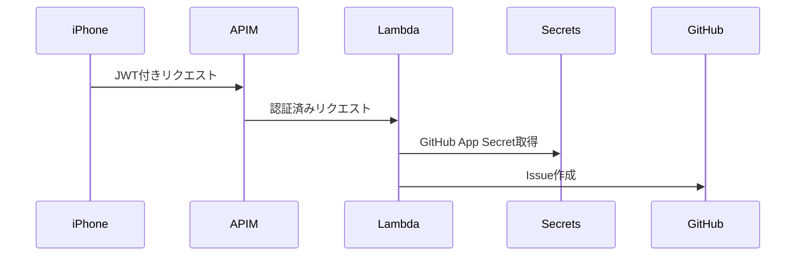
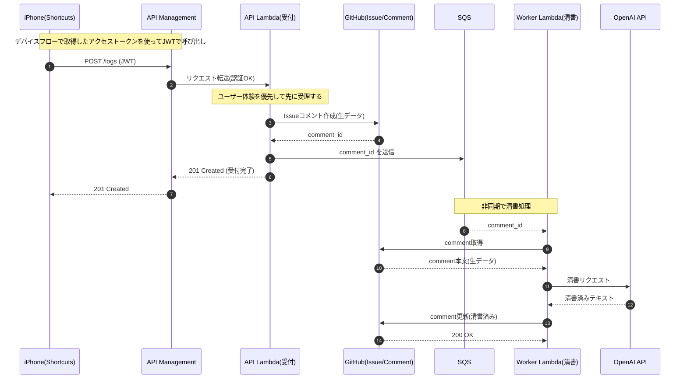
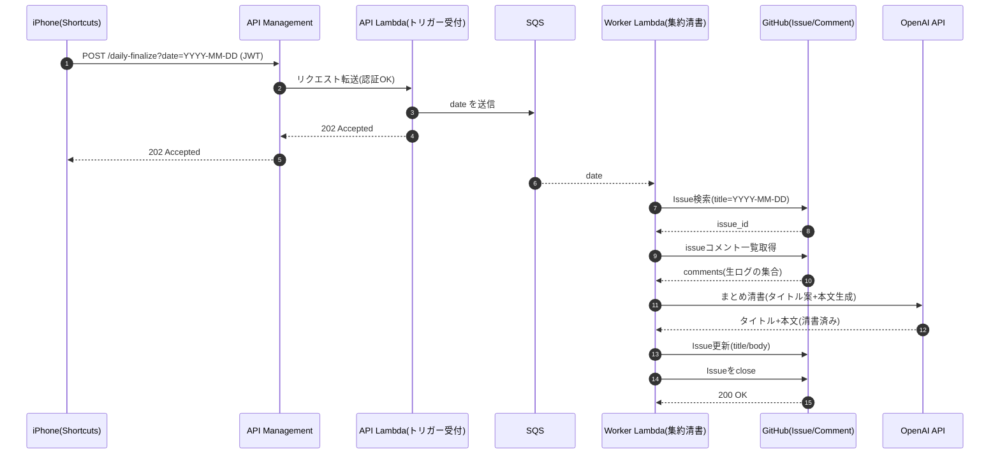

## これは

最近作っている、自分の「思考ログ」をGitHub Issueに蓄積する仕組みのお話です。

## きっかけ

ここ半年くらいChatGPTやM365 Copilotを使い続けていて、あることに気づきました。

> LLMに自分の普段の思考をコンテキストとして渡していくと、出力がより自分の指向に近づく

まぁ、当たり前と言えば当たり前なのですが。

例えば日々の判断基準、価値観、語彙、文体など、それらをAIが学習していくと、返ってくる文章が「自分らしく」なります。

私は登壇やシステム設計の壁打ちをすることが多いのですが、LLMに自分の思考を理解してもらうと、より的確なフィードバックが得られるようになりました。

ならば、日々の思考そのものをデータとして蓄積していけばいいのでは？と思い、実験を開始しました。

## 24時間録音の必要性

一時期、「24時間音声を録音して文字起こしする」というサービスが話題になっていました。

この「思考を全部記録する」というアイデア自体は大変素晴らしく、コミュニティイベントの懇親会でも「日々の自分の思考を記録するという意味で、あのサービスは理想的なのでは？」という話が出ていました。

ただ、実際に検討してみると

* 知人が使っているサービスは既に終了していた
* 現行サービスもそれなりに高額
* プライバシーや運用コストの問題で常時録音はハードルが高い

などの敷居の高さがあり、何より「全部必要か？」という疑問が湧いてきました。

そもそも、私が欲しいのは「思考の断片」や「気づき」を忘れずそのタイミングで記録することであって、常に全てを記録する必要はないのでは？と考えるようになりました。

## 保存先にGitHub Issueを選択

今回のログの保存先に必要な要件は以下の通りです。

* Markdownで書ける
* タスク化がそのままできる
* APIが強い
* スマホやPCなどマルチデバイスでアクセスできる

Notionなども検討したのですが、最終的にGitHub Issueに集約することにしました。これは単純に私がGitHubに慣れているから、という理由が大きいです。

具体的には

* タイトルに日付を入れる
* 最終的に本文に1日分をまとめる
* コメントとしてこまめに記録する

という運用にしました。

普段使いをするにはとにかくフリクションを減らすことが重要ですので、慣れている道具を使うのが一番です。

## バージョンの進化

### V1：ChatGPTアプリ＋コピペ

まずはシンプルに日記を書くところから。入力のフリクションを下げるために音声入力を使う実験として、ChatGPTアプリに直接音声入力してみました。

* ChatGPTアプリに音声入力
* Issue用タイトルと本文に清書してもらう(定型のプロンプトを用意)
* GitHubモバイルに貼り付け

思ったより音声入力の精度は高く、「えーっと」「あの、あれだ」とか不要な単語は綺麗に除去されるし、句読点も適切に入るのでかなりストレスフリーに思考をテキスト化できました。

でも最後のコピペが地味に面倒。

とりあえず、

* 音声で入力すると手入力の手間が省ける
* 入力への心理的ハードルが下がる
* OSの音声入力だけでなくChatGPTに清書してもらうとさらに精度が上がる

ということで、今年は日記を書かさずつけられるようにはなりました。

### V2：ショートカットでローカルMarkdown追記

次は「最後にまとめて1日分喋る」というのを避け、「こまめに記録して最後にまとめてIssueにする」というのにチャレンジしました。道具としてはiOSのショートカットを選択。

* ショートカットで音声入力またはテキスト入力を起動
* 内容を1日1ファイルに追記
* 最後にまとめてChatGPTへ流す別ショートカットを用意

良かった点：

* 追記が楽
* こまめに入力できる

課題：

* 最後はコピペなのは変わらない
* 長文だとChatGPTアプリがタイムアウト(アプリ内には残ってるから消えるわけではないが)

### V3：ショートカットから直接GitHubへ

ここで一気に進化。何とかしてGitHubに直接保存するようにして、コピペの手間を減らそうとしました。

#### 課題

* ChatGPTやM365 Copilotは直接GitHub APIを叩いてIssueは作成できない
* ショートカットからHTTPリクエストを送るのは簡単だが、iPhoneにPATを保存したくない

#### 解決策

* GitHub APIを叩く権限はPATではなくGitHub Appsを利用
* シークレットはスマホに置かないでAWS Secrets Managerに安全に保存
* AWS LambdaがGitHub APIを呼び出す

#### 認証設計

* API ManagementでJWT認証
* 認証はEntra IDを利用
* デバイスフローをショートカットで実装
  * 初回だけショートカットからブラウザが起動され、クリップボードにコピーされたデバイスコードを貼り付けて認証する
* アクセストークンとリフレッシュトークンはデバイスのローカルファイルに保存
* 通常アクセスはアクセストークンで行い、期限が切れたらショートカットがリフレッシュトークンで更新

正直、やりすぎである。ショートカットで全部やる意味 is 何。でも、この「やりすぎ」こそが技術的チャレンジでもあり、エンジニアの楽しみでもあります。

あと、PATをスマホに置くのに比べたら圧倒的に安全。あとはローカルファイルの保存だけ何とかしたい。

#### 処理シーケンス

全体の処理シーケンスはこんな感じです。

### V4：OpenAI API 非同期清書

一旦の完成形。非同期化することで入力体験を最優先にし、重い処理は裏で回す設計にしました。

#### フロー

1. ショートカット → Lambdaに生データ送信
2. Lambda → Issueコメント作成して201レスポンス返す
3. LambdaはコメントIDをSQSへ
4. SQSトリガーLambda → OpenAI APIで清書
5. コメント更新

さらに、

1日の終わりに「清書トリガー」を送ると：

* 該当Issue(タイトル＝日付)のコメントを全取得
* まとめて清書
* タイトルと本文更新
* Issueをクローズ

現在はトリガーは手動でショートカットで送っている(カレンダーのUIで日付を選択するだけ)けど、いずれ完全自動化も可能です。

ただ、日によっていつ清書したいかはまちまちなので、この運用で十分かとも思ってます。

#### 処理シーケンス

コメントを書き足していくフローはこんな感じです。

1日1回の「まとめ清書」のシーケンスはこんな感じです。

### V4.1：音声入力の安定化

あと1点、iOSのショートカットの「音声入力」アクションはOSのスリープで止まって、そこで録音が途切れてしまうことがわかりました。それを避けるために入力中は常に画面をスリスリしてたのですがこれが地味にストレスでした。

そこでこれを「オーディオを録音」にアクションに変更しました。

## 完成した体験

ということで、今はこういう体験になりました。

* 気づいたらボタン1つで録音
  * 最近買った[nwm dots](https://nwm.global/products/dots)のマイクが快適
* 喋れないときはテキスト入力
* すぐIssueコメントになる(数秒程度)
* 音声は軽く清書される
* 1日1回まとめて整形
* 必要に応じてGitHub Projectsから自然にタスク化できる

日々の記録を取るフリクションが自分の中では限りなく小さくなっています。

そして、ChatGPTやM365 CopilotにこのIssueをコンテキストとして渡す(コピペ用のコメントも成形してもらってます)と、より自分の思考に近いフィードバックが得られるようになりました。

最近は週末に、GitHub CopilotやChatGPT,M365 CopilotにこのIssue群から一週間の振り返りと来週気をつけるアドバイスなどももらってます。これは役に立ってるか・・というと、まぁ、あまり具体的なアドバイスはもらえないのですが、なんとなく「自分の思考を客観的に見てくれている」感じがして、精神衛生上は良いです。

何よりも、自分の思考が記録されることで、自分自身も自分の思考をより理解できるようになった気がします。記録することで自分の思考の癖やパターンが見えてきて、自己理解が深まっている感覚があります。

## まとめ

しばらく運用してみて、AI(LLM)に自分の思考を渡すのはもちろんですが、自身の思考を記録しておくことはとても大切だと改めて思いました。  

自分の思考をちゃんと言語化し、記録しておくことは、自己理解や自己成長のために必要なことだと思います。AIがどれだけ進化したとしても、人間が自分の思考を正しく共有しなければ、AIも正しく理解できないのです。そして、これはAIだけではなく、人間が相手でも、そして自分自身に対しても同じことが言えると思います。

そして、この「思考ログを取る」ために僕に必要だったのは「24時間録音」ではなく「思いついたことをすぐ記録できる環境」でした。

ショートカットでの実装などはちょっとやり過ぎ感はありますが、今の所は満足しています。

いずれ具体的な実装方法は別ブログで書こうかと思いますが、ショートカットを共有するのが地味に面倒ですね・・・どうしようw

皆様の参考になれば幸いです。
